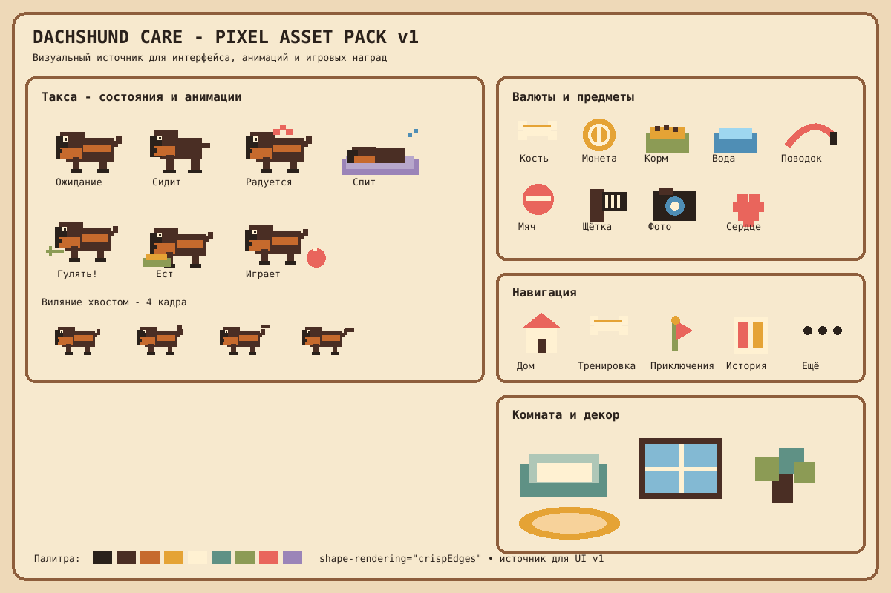

# Pixel Asset Pack v1

Первый зафиксированный визуальный набор для Dachshund Care App. Он основан на согласованном направлении: тёплый кремовый интерфейс, коричневые пиксельные контуры, чёрно-подпалая такса, мягкие коралловые, зелёные, бирюзовые и золотые акценты.

## Что уже зафиксировано

- состояния таксы: ожидание, сидит, радуется, спит, ждёт прогулку, ест, играет;
- четыре кадра виляния хвостом как база первой анимации;
- валюты: косточка и монетка;
- предметы ухода: корм, вода, поводок, мяч, щётка, камера и сердце;
- нижняя навигация: Дом, Тренировка, Приключения, История, Ещё;
- декор комнаты: лежанка, окно, ковёр и растение;
- единая цветовая палитра и правило `shape-rendering: crispEdges`.

## Где лежат ассеты

- `public/assets/pixel/v1/asset-pack.svg` - мастер-лист, который можно открыть прямо в GitHub и использовать как источник для интерфейса;
- `docs/visual/asset-pack/v1/README.md` - описание и правила набора.

## Что делаем следующим шагом

Из этого мастер-листа выделяем отдельные production-ассеты в `public/assets/pixel/v1/`: `dog/`, `currency/`, `care/`, `navigation/`, `room/`, `effects/`. После этого начинаем заменять текущий интерфейс приложения на пиксельные изображения, не меняя функциональную логику.

До утверждения визуала новые продуктовые функции не наращиваем.