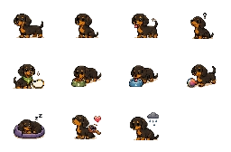
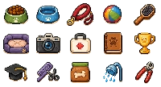
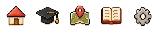
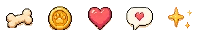
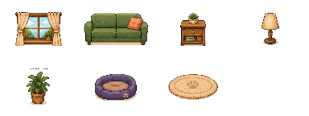

# Generated pixel asset pack v2

This is the approved second-generation visual system used by the app. The production atlases below are extracted from the generated high-detail source sheets rather than recreated with CSS primitives.

## Character states

## Care and action icons

## Navigation

## Currency and effects

## Room props

